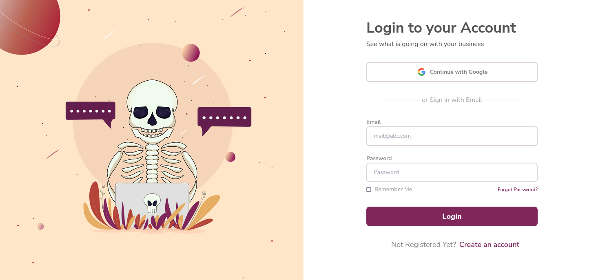

# Login Page with Tailwind CSS and React.js



This project implements a login page using React.js and Tailwind CSS. It's designed to provide a simple and user-friendly interface for user authentication in web applications.

## Table of Contents

- [Demo](#demo)
- [Features](#features)
- [Technologies Used](#technologies-used)
- [Installation](#installation)
- [Usage](#usage)
- [Contributing](#contributing)
- [License](#license)

## Demo

Check out the live demo of the login page [here](https://hunters-shop-mintech-dot.netlify.app/).

## Features

- Responsive design with Tailwind CSS
- User-friendly UI
- Form validation

## Technologies Used

- **React.js**
- **Tailwind CSS**


## Installation

To get a local copy up and running, follow these simple steps:

1. **Clone the repository:**
   ```sh
   git clone https://github.com/mintech-dot/Hunters-Shop.git
   ```

2. **Navigate to the project directory:**
   ```sh
   cd Hunters-Shop
   ```

3. **Install dependencies:**
   ```sh
   npm install
   ```

## Usage

To start the development server, run:

```sh
npm run dev
```

This will run the app in development mode. Open [http://localhost:5173](http://localhost:5173) to view it in the browser.

## Contributing

Contributions are what make the open-source community such an amazing place to learn, inspire, and create. Any contributions you make are **greatly appreciated**.

1. Fork the Project
2. Create your Feature Branch (`git checkout -b feature/AmazingFeature`)
3. Commit your Changes (`git commit -m 'Add some AmazingFeature'`)
4. Push to the Branch (`git push origin feature/AmazingFeature`)
5. Open a Pull Request

## License

Distributed under the MIT License. 